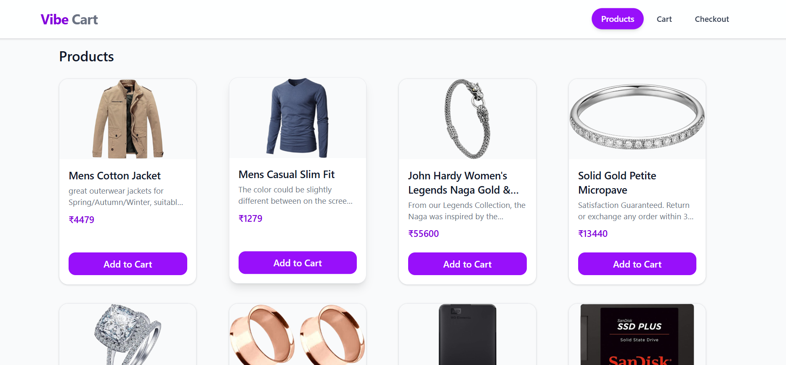
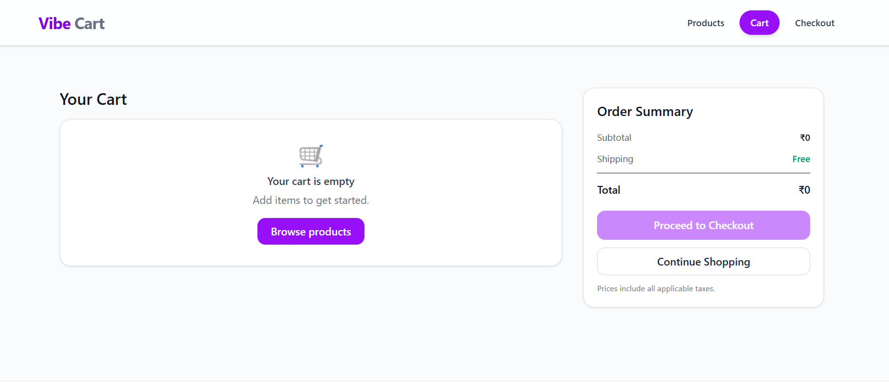
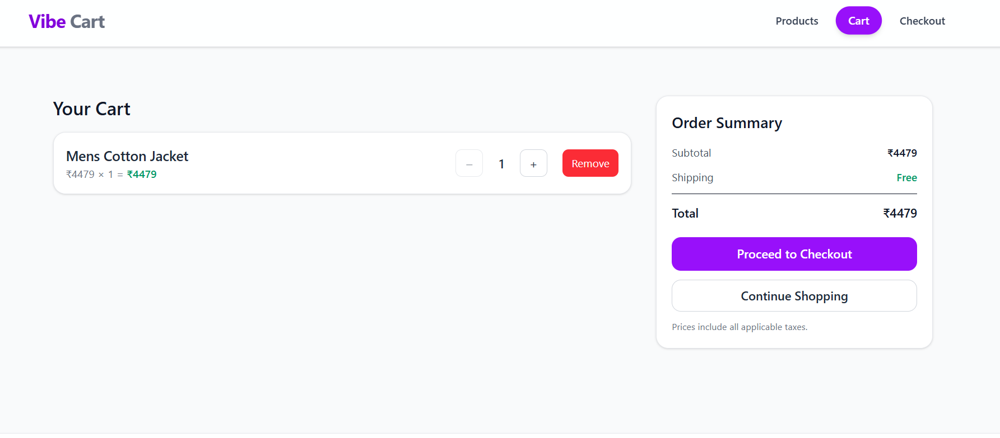
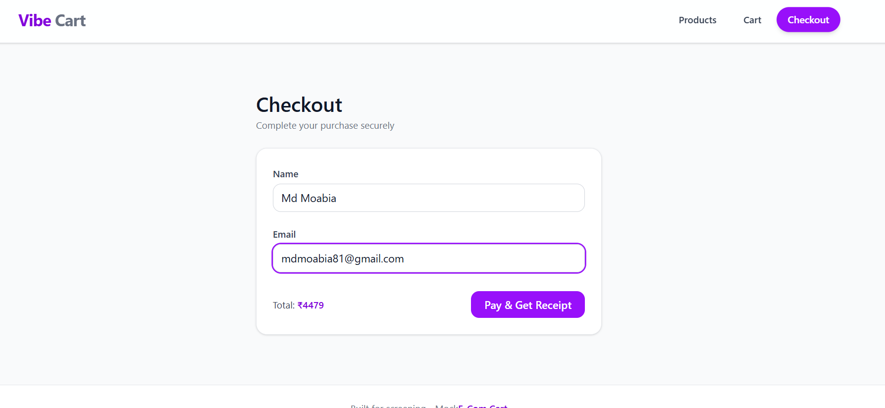
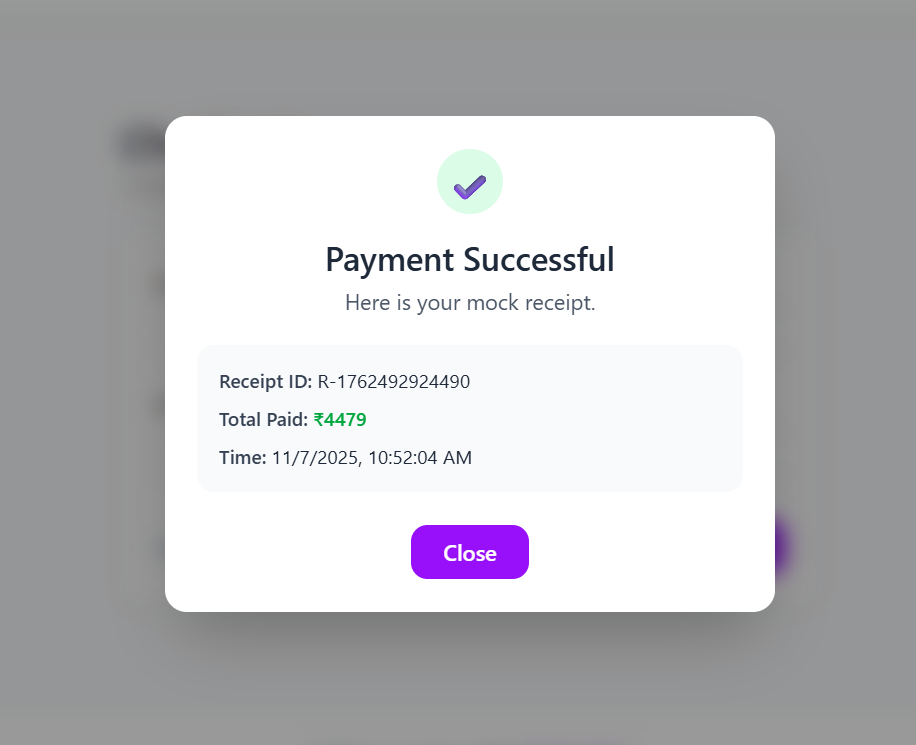

# 🛒 Mock E-Commerce Cart App

A full-stack MERN project where users can browse products and manage their cart (add, remove, increase/decrease quantity). The app demonstrates REST APIs, MongoDB CRUD, React UI, and state management.
---

## Features
✔ Add items to cart  
✔ Remove items from cart  
✔ Increase / decrease quantity  
✔ Cart total updates dynamically  
✔ Pay and get Receipt of purchased amount  
✔ Backend APIs with MongoDB  
✔ Fully responsive UI

## Screenshot -----
## Home Page


## Cart page


## Cart with product


## Checkout page


## Receipt Page

---

## Tech Stack
### **Frontend**
- React
- Axios
- React Router DOM
- Tailwind

### **Backend**
- Node.js
- Express.js
- MongoDB


---

## Installation & Setup

### 1. Clone the repository
```bash
git clone https://github.com/moabia1/e-com.git
cd project-name
cd backend
npm install

## Frontend
cd ../frontend
npm install
npm run dev

